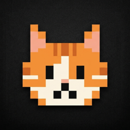
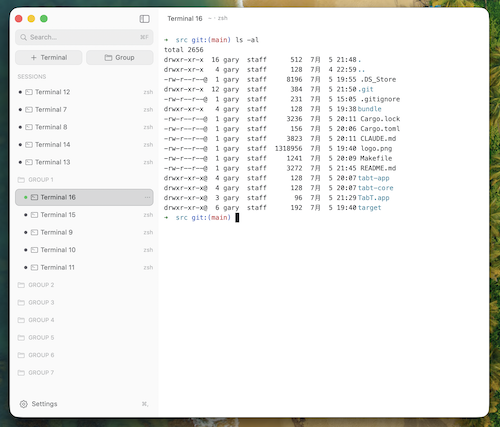
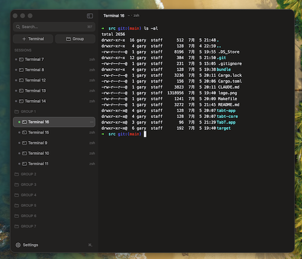

<p align="center">
  
</p>

# TabT

A small, fast native terminal emulator for macOS, written in Rust on top of AppKit. Multi-tab
sessions with a self-drawn sidebar for tabs and groups, and a dependency-free VT/ANSI core.

<p align="center">
  
  
</p>

## Features

1. **Multi-tab sessions** — one PTY per tab, listed under "Sessions" in the sidebar; ⌘T for a new one.
2. **Groups** — organize tabs into named, collapsible groups; drag to reorder tabs and groups.
3. **Search & rename** — ⌘F filters the list; double-click a tab/group to rename in place.
4. **Color themes** — 9 built-in schemes (Solarized, One Dark, Dracula, Nord, GitHub Light, …);
   the whole UI derives from the active theme, staying legible on light and dark alike.
5. **Fonts** — 10 classic monospace families, adjustable live with ⌘= / ⌘- / ⌘0.
6. **Settings dialog** (⌘,) — theme, font, sidebar side, border visibility, all applied live.
7. **Per-tab status dot** — click a tab's dot to give it a color.
8. **Persistence** — layout, groups, tabs, theme, font, and window size are restored on launch.
9. **VT/ANSI core** — SGR colors and text attributes, cursor/scroll/erase operations, alternate
   screen buffer, DEC private modes, DSR/DA, OSC title and cwd reporting, UTF-8.

## Build & run

Requires macOS and a Rust toolchain (`rustup.rs`).

```sh
git clone <repo-url> tabt && cd tabt/src
make run
```

This builds a release binary, bundles it into `TabT.app`, ad-hoc code-signs it, and launches it.

## Keyboard shortcuts

| Shortcut | Action | | Shortcut | Action |
|---|---|---|---|---|
| ⌘T | New terminal | | ⌘F | Search sessions |
| ⇧⌘N | New group | | ⌘B | Toggle sidebar |
| ⌘W | Close tab | | ⌘K | Clear screen |
| ⇧⌘R | Reveal cwd in Finder | | ⌘= / ⌘- / ⌘0 | Font size ± / reset |
| ⌘, | Settings | | ⌘C / ⌘V / ⌘A | Copy / paste / select all |

Also: double-click the header to zoom the window, double-click a tab/group name to rename it,
and click a tab's status dot to set its color.

## Development

A two-crate Cargo workspace: `tabt-core` (the VT/ANSI engine — pure logic, zero dependencies,
runs and tests on any platform) and `tabt-app` (the AppKit UI layer via `objc2`, macOS-only).

```sh
make test    # tabt-core unit tests
make run     # build, bundle, and launch TabT.app
make echo    # standalone PTY echo loop, a debugging tool; run in a real terminal, not an IDE panel
make bloat   # binary size audit (needs `cargo install cargo-bloat`)
make clean   # remove build artifacts
```

Notes for contributors:

- `tabt-app` must run as a `.app` bundle (`make run`) — a bare binary won't get focus or a menu
  bar, which is normal macOS behavior for unbundled processes.
- The release profile is size-tuned (`opt-level="z"`, `lto`, `panic="abort"`, `strip`), so a
  panic anywhere terminates the whole process rather than unwinding — keep that in mind when
  touching code that parses PTY output or user input.
- `objc2`/`objc2-foundation`/`objc2-app-kit` are pinned to a matched set of versions; if a type
  or method fails to resolve after a dependency bump, check `cargo tree | grep objc2` and the
  `objc2-app-kit` feature list in `tabt-app/Cargo.toml` (it gates one feature per Objective-C class).

## License

MIT — see [LICENSE](LICENSE).
